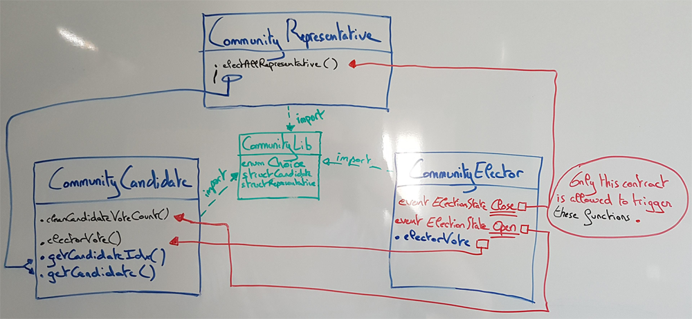
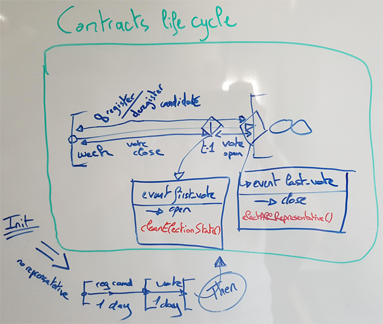

# SnipsDaoChallenge

Your challenge is to write an ethereum smart contract to elect 10 community “representatives”. <br>
The election must run continuously, enabling a rotation of the 10 representative.

The contract must handle:

- receiving votes
- receiving applications to become a representative
- running the election

**Summary**

* [Stack technique](#stack-technique)
* [Design](#design)
* [How this election system can be cheated](#how-this-election-system-can-be-cheated)
* [Installation](#installation)
* [Tests](#tests)
* [Playing](#playing)

## Stack technique

- Ethereum in memory blockchain, Ganache Version 1.1.0 (GUI or CLI)
- Truffle v4.1.8 (core: 4.1.8)
- Solidity v0.4.23 (solc-js)
- Node v9.7.1
- npm v6.0.1

## Design

[](docs/pictures/snips_dao_design.png)

<br>

| Contract                | Responsability                 |
|-------------------------|--------------------------------|
| CommunityRepresentative | Reference to query current representative's identity from any community that the DAO support. |
| CommunityCandidate | Manage candidate registration or deregistration and keep their vote up to date. This contract guarantees that any vote came from CommunityElector's contract. |
| CommunityElector | Core of the DAO as it's main responsability is to manage the state of the continuous rotating election. It also handle electors and verify that they do not vote more than once for each community. |

<br>

[](docs/pictures/snips_dao_lifecycle.png)

## How this election system can be cheated

Well well well.

## Installation

#### Get and Configure Ganache

Get [ganache](http://truffleframework.com/ganache/) GUI, and launch it.<br>
At the top right of the windows, clics on the "option" wheel.<br>

On the **SERVER** tab, where you should be by default, check that :
- hostname is 127.0.0.1
- port is 7545
- network id is 5777
- both Automine and error are activated

On the **ACCOUNTS & KEYS** tab :
- increase the total accounts to generate to 25
- set the Mnemonic to "onion tape alien arctic brush claim verb panther panic issue domain away".

After these changes, just clic on RESTART button on the top right.

#### Install truffle

```
npm install truffle -g
```

## Tests

:heavy_exclamation_mark: As it takes times to generate *fake* blocks with ganache, in **DEV** we set *dayInBlock* to 40 in both `CommunityElector.sol` and `CommunityElector.js` but should be set to 5760 in **PROD**.<br>
In the same logic, we also modify `startVotingBlock` in the `modifier closeElectionState` within CommunityElector contract.

```
truffle test
```

## Playing

```
truffle migrate --network development // --reset if needed
truffle console --network development
```

Then check `playground_cmd_truffle_console.js` in `docs` if you want to see cmd line exemples to interact within truffle's console console.
